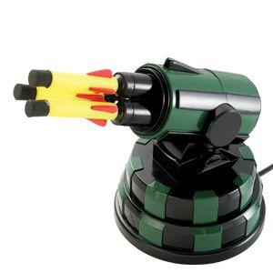

# USBML4J
A USB Missile Launcher for Java library

This is a simple Java API for interacting with the original Dream Cheeky USB Missile Launcher (see picture below).  Works on Windows, Mac, and Linux.

## Example Code
    // discover all USB missile launchers
	DefenseGrid grid = DefenseGrid.getInstance();
		
	// perform initialization (zeroing) of each missile launcher in parallel
	grid.initializeMissileLaunchers();
		
	// get an array of missile launchers to control
	MissileLauncher[] launchers = grid.getMissileLaunchers();
		
	// test each missile launchers ability to aim up, down, left, right, and fire
	if(launchers.length == 0){
		System.out.println("No USB Missile Launchers could not be found.  Try disconnecting and reconnecting USB devices from port.");
	} else {
		for(int i=0; i<launchers.length; i++){
			MissileLauncher ml = launchers[i];
			int launcherID = i+1;
			ml.adjustVerticalPosition(500); // rotate up for 500 milliseconds from home position
			ml.adjustVerticalPosition(-500); // rotate down for 500 milliseconds from home position
			ml.adjustVerticalPosition(0); // return to vertical home position
			ml.adjustHorizontalPosition(500); // rotate right for 500 milliseconds from home position
			ml.adjustHorizontalPosition(-500); // rotate left for 500 milliseconds from home position
			ml.adjustHorizontalPosition(0); // return to horizontal home position
			ml.fire(); // fire zeee missiles!!!!!!!
		}
	}
